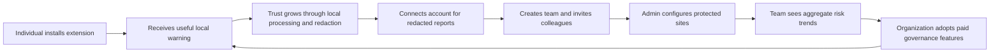

# HallGuard Business Model

## Document purpose

This document describes the business model supported by the current HallGuard codebase and a recommended commercialization path. It separates implemented product facts from business proposals so roadmap assumptions are not mistaken for shipped functionality.

**Product state:** early-stage product/MVP. The repository contains a working browser extension, website/account dashboard, API, MongoDB persistence, organization management, privacy-safe reporting, governed offline ML tooling, and signed intelligence-package infrastructure. It does **not** currently contain billing, subscriptions, payment-provider integration, contractual SLAs, or a finalized open-source license.

## Executive summary

HallGuard is a local-first AI permission firewall. It adds a safety checkpoint at the moment a person pastes, uploads, or sends information to an AI website. The product is initially focused on ChatGPT, Claude, and Gemini, while also supporting user- and organization-configured HTTPS domains.

The commercial wedge is straightforward:

> Help individuals and small technical teams prevent accidental disclosure to AI tools without sending the content being protected to another cloud scanner.

The browser extension performs inspection and enforcement locally. The hosted service supplies identity, redacted reporting, team administration, protected-site policy, aggregate trends, and reviewed detection-intelligence distribution. This split supports a freemium/open-core-style acquisition model with paid team and managed-service value, while preserving a credible privacy position.

## The customer problem

AI chat interfaces make data sharing frictionless. Users routinely paste source code, API credentials, customer messages, contracts, contact details, internal documents, and suspicious third-party instructions into AI tools. Existing controls often operate too late, cover only one vendor, or require heavyweight enterprise deployment.

HallGuard addresses four immediate risks:

1. **Sensitive-data disclosure:** credentials, tokens, contact data, card-like data, and other sensitive patterns can be sent unintentionally.
2. **Risky uploads:** a filename, type, or size may indicate that a file deserves review before upload.
3. **Prompt injection:** AI-generated or pasted content may contain instructions intended to override rules, reveal hidden data, or manipulate the user.
4. **Scam and fraud language:** suspicious urgency, payment, impersonation, or social-engineering language may warrant a warning.

The key moment of value is before the action becomes irreversible. HallGuard warns, requires confirmation, or offers a redacted alternative inside the current browser workflow.

## Product value proposition

### For individual users and developers

- A warning appears at paste, send, submit, Enter-key, and upload-selection moments.
- Protection covers multiple AI vendors through one consistent browser layer.
- Detection remains available offline and does not depend on a prediction API.
- Recognized sensitive values can be masked and copied or inserted as redacted text.
- A small local history helps users understand what was caught.
- Users can independently control detection categories, sensitivity, report sync, and improvement telemetry.

### For teams and small organizations

- Owners and administrators manage members and organization-protected domains.
- Members inherit managed protected-site entries.
- Redacted event records provide visibility into categories, severity, decisions, feedback, tools, and hostnames.
- Organization dashboards summarize activity and show daily trends without returning raw prompt content or per-user prompt detail.
- Benchmark and trust information can be exposed to authorized administrators.
- Detection intelligence can be updated through reviewed, signed, data-only packages without making raw-content inference a cloud dependency.

### For security-conscious buyers

- Raw prompt inspection is local-first.
- File contents are not uploaded or inspected by the current upload detector; only metadata is checked.
- Synced records use capped, redacted snippets and allowlisted metadata.
- Improvement telemetry is separate, off by default, bounded, numerical, and content-free.
- Server-side validation provides a second boundary against covered raw values.
- Intelligence updates are authenticated, versioned, compatibility-checked, and atomically activated with last-known-good fallback.

## Target customers and buyer personas

| Segment | Primary user | Economic buyer | Pain | Initial offer |
| --- | --- | --- | --- | --- |
| Individual developers | Developer, consultant, founder | Same person | Accidental API key/source-code leakage into AI chats | Free or low-cost local extension with optional personal reporting |
| Small technical teams | Developers, support, product, operations | Engineering manager, agency owner, founder | Inconsistent AI usage practices and no shared visibility | Per-seat team plan with managed sites and aggregate reports |
| Agencies and service firms | Consultants handling several clients | Agency owner/security lead | Cross-client data exposure and reputational risk | Team policy, redacted audit trail, custom domains |
| Regulated or security-sensitive SMBs | Staff using public and internal AI tools | IT/security/compliance lead | Need for preventive controls without uploading prompts to a third-party scanner | Managed deployment, governance, retention controls, support |
| Larger enterprises, later | Workforce using many AI surfaces | CISO, security engineering, procurement | Fleet-wide AI governance, integrations, compliance evidence | Future enterprise plan after deployment, SSO, audit, and compliance maturity |

The best near-term beachhead is developers and small technical teams. The repository does not yet support the fleet management, SSO, compliance certifications, endpoint breadth, or integrations expected in a mature enterprise sale.

## Positioning

Recommended category statement:

> HallGuard is the lightweight, local-first browser permission layer for AI disclosure risk.

Recommended short promise:

> Catch sensitive data before it reaches AI.

HallGuard should not position itself as a complete enterprise DLP replacement. Its immediate differentiation is the combination of:

- browser-native pre-send intervention;
- local inspection and offline operation;
- cross-vendor protection;
- usable redaction and continue-safely workflow;
- redacted-only personal/team reporting;
- configurable protected domains;
- transparent, testable detection governance.

## Competitive context

HallGuard overlaps three established categories:

- **Developer secret scanning:** GitGuardian and TruffleHog are strong in repositories, CI/CD, and developer systems. HallGuard focuses on the browser moment before information is disclosed to AI.
- **Enterprise DLP and AI governance:** Nightfall AI, Harmonic Security, and Prompt Security have broader enterprise coverage. HallGuard's opening is simpler adoption, local-first trust, and small-team usability.
- **AI-native security:** Lakera and similar vendors focus heavily on securing AI applications, models, agents, and prompt-injection boundaries. HallGuard initially focuses on human-side disclosure in browser workflows.

AI vendors and browsers may also add native protections. HallGuard's answer is a neutral layer across vendors, wrappers, custom domains, and internal AI surfaces, with a unified policy and reporting experience.

## Business Model Canvas

### Customer segments

- Individual developers and power users.
- Startups, agencies, consultancies, and small engineering teams.
- Support, operations, legal, and product teams using public AI tools.
- Security-conscious SMBs needing lightweight AI controls.
- Enterprises only after the product adds the controls required for enterprise procurement.

### Value propositions

- Prevent disclosure before send rather than discovering it afterward.
- Avoid sending raw sensitive text to a remote classification service.
- Work across multiple AI websites and custom domains.
- Give users a safe alternative through redaction instead of only blocking work.
- Give teams useful aggregate evidence without exposing prompt bodies.
- Keep detection capability current through reviewed signed packages.

### Channels

- Chrome Web Store when the listing is ready; manual early-access installation before then.
- Developer communities, security communities, GitHub, technical content, and launch platforms.
- Bottom-up team adoption driven by individual users.
- Partnerships with agencies, managed service providers, security consultancies, and AI governance advisors.
- Direct founder/security-led sales for team and managed deployments.

### Customer relationships

- Self-service onboarding for individuals.
- Product-led team creation and member invitation.
- Documentation-led trust and privacy evaluation.
- Email/community support for free users.
- Priority support, onboarding, and policy guidance for paid organizations.
- Security review and deployment assistance for future enterprise customers.

### Revenue streams

No revenue mechanism is implemented yet. A suitable staged model is:

1. **Free individual tier:** local detection, core warnings, local history, base protected sites, and transparent trust documentation.
2. **Personal Pro tier:** longer hosted redacted history, additional personal domains, advanced controls, exports, and premium support.
3. **Team tier:** per active member/month for organization membership, managed protected sites, aggregate summaries/trends, administrative roles, centralized policy, and managed intelligence updates.
4. **Business/Enterprise tier:** annual contract for SSO/SCIM, policy templates, longer or configurable retention, audit APIs, deployment controls, support SLAs, self-hosted or regional options, and compliance evidence—only after these capabilities exist.
5. **Optional services:** onboarding, custom rule research, policy design, deployment review, and security workshops.

The free tier should preserve meaningful local protection. Charging for the safety baseline would weaken adoption and trust. Hosted coordination, administration, retention, governance, and service assurance are the natural paid value.

### Key activities

- Maintain high-quality deterministic detectors and redaction rules.
- Tune warning UX to reduce false-positive fatigue.
- Operate account, reporting, organization, and intelligence services.
- Maintain privacy and security review gates.
- Build synthetic and licensed evaluation corpora without customer-content leakage.
- Publish reviewed intelligence packages and maintain signing-key operations.
- Support changing browser DOMs and AI websites.
- Measure activation, protection outcomes, retention, and team conversion.

### Key resources

- Browser interception and local detection engine.
- Redaction specification and test corpus.
- Rule/model release process and signed-package trust chain.
- Website, account dashboard, organization workflows, and reporting data model.
- Brand credibility around privacy, transparency, and reliable warnings.
- Security/privacy/maintainer review capability.

### Key partners

- Browser extension distribution platforms.
- Security researchers and credential providers supplying official format documentation.
- Privacy/security auditors.
- Cloud hosting and managed database providers.
- Potential channel partners such as MSPs, agencies, and security consultants.

### Cost structure

- Engineering across extension, website, API, and ML/release tooling.
- Continuous compatibility work for AI-site DOM changes.
- Security review, code signing/key custody, incident response, and audits.
- Backend/database hosting for accounts and redacted reports.
- Support and customer success.
- Legal, privacy, compliance, and extension-store operations.
- Evaluation data licensing and independent benchmark work.

Because prediction runs locally, inference cost does not grow with every keystroke or prompt. Hosted costs scale mainly with accounts, metadata/report storage, intelligence-package traffic, support, and administration.

## Recommended packaging and pricing logic

Exact prices require customer interviews and usage/cost data. The following is packaging guidance, not a shipped price list.

| Capability | Free | Personal Pro | Team | Enterprise future |
| --- | --- | --- | --- | --- |
| Local deterministic protection | Included | Included | Included | Included |
| Bundled/local classifier signals | Included according to release status | Same | Same | Same |
| Core supported AI sites | Included | Included | Included | Included |
| Personal custom sites | Limited | Expanded | Expanded | Policy-controlled |
| Local redacted history | Included, bounded | Included | Included | Included |
| Hosted redacted reports | Limited/short retention | Expanded | Included | Configurable |
| Organization roles/members | — | — | Included | Included |
| Managed protected sites | — | — | Included | Included |
| Aggregate team summaries/trends | — | — | Included | Included plus exports/API |
| Signed intelligence updates | Security baseline where operationally feasible | Included | Included | Managed channels/rings |
| SSO/SCIM and fleet deployment | — | — | — | Future |
| SLA/security review/self-hosting | — | — | — | Future |

Pricing should be tested as a per-active-member subscription for Team, with a minimum monthly workspace charge. Enterprise pricing should be annual and value-based. Do not set price solely from storage costs; the value is avoided disclosure, faster governance, and reduced security-review burden.

## Acquisition and go-to-market

### Phase 1: developer-led validation

- Lead with accidental credential leakage into ChatGPT/Claude/Gemini.
- Publish clear installation, privacy, detection-limit, and benchmark documentation.
- Use a meaningful free local product to earn trust.
- Collect qualitative feedback about warning accuracy, workflow interruption, and redaction usefulness.
- Avoid unverified accuracy, compliance, or “prevents all leaks” claims.

### Phase 2: small-team conversion

- Let an individual create an organization and invite teammates.
- Demonstrate managed protected domains and aggregate redacted reporting.
- Target agencies, startups, and consultancies with a short sales cycle.
- Make conversion about shared policy and visibility, not about removing local protection from the free tier.

### Phase 3: managed security product

- Add centralized detection settings and enforceable policy semantics.
- Add deployment controls, SSO/SCIM, audit APIs, SIEM export, retention configuration, and support commitments.
- Complete independent security/privacy review and required certifications.
- Offer controlled rollout rings for signed intelligence packages.

## Product-led growth loop

This loop depends on warning quality. Excessive false alarms break the loop because users disable the extension before discovering team value.

## Business-critical workflows

### Individual activation

1. User discovers HallGuard through the website, extension store, community, or referral.
2. User installs the extension and sees default protection for ChatGPT, Claude, and Gemini.
3. A risky action triggers an explainable warning.
4. The user cancels, proceeds, copies redacted content, or uses redacted content.
5. Redacted local history creates repeat value.
6. The user optionally creates an account for synchronized redacted reports.

### Team conversion

1. An authenticated user creates an organization and becomes owner.
2. The owner invites members by email and assigns owner/admin/member roles within current constraints.
3. Owners/admins configure organization-protected domains.
4. Members' website data is bridged into the extension, where managed sites become protected.
5. Redacted member events support organization summaries and trends.
6. The buyer pays for central coordination, governance, and evidence.

### Detection improvement

1. Local rules and the shadow classifier produce results.
2. Separately consented users may send bounded numerical features and feedback.
3. The backend stores eligible events with a 90-day expiry.
4. Structural signals are aggregated only above privacy thresholds.
5. Proposed rule/model improvements require official sources, synthetic/approved data, benchmarks, and independent reviewers.
6. Reviewed data-only packages can be signed, published, verified, and atomically activated.

This loop is intentionally not autonomous. Signing authenticates a release but does not replace review.

## Core metrics

### Acquisition and activation

- Website-to-install conversion.
- Installation-to-first-protected-session conversion.
- Time to first warning and time to first safe-redaction action.
- Percentage of users who retain default protected sites.
- Account connection rate.

### Product quality

- Warning rate per protected session.
- Correct-warning, false-alarm, and missed-risk feedback rates.
- Cancel/block, allow-anyway, and redacted-copy/use rates.
- Detection latency at representative payload sizes.
- Redaction coverage and raw-leak test rate.
- Extension errors caused by site DOM changes.

### Retention and trust

- Weekly/monthly active protected users.
- Extension disable/uninstall rate after warnings.
- Report-sync opt-in rate.
- Improvement-telemetry opt-in and deletion rates, tracked without coercion.
- Trust/privacy page engagement and security-review completion time.

### Monetization

- Free-to-paid personal conversion.
- Individual-to-team workspace conversion.
- Activated seats per organization.
- Monthly recurring revenue, annual recurring revenue, ARPA, churn, and net revenue retention.
- Support cost and infrastructure cost per active organization.

Privacy-safe measurement must not introduce raw prompt collection, exact candidate tracking, cross-site behavior histories, or dark-pattern consent.

## Defensibility and moat

Regex patterns alone are not a durable moat. Potential compounding advantages are:

- a trusted local-first architecture users and security reviewers can verify;
- high-quality redaction with independent client/server enforcement;
- a benchmarked detector stack that balances recall and warning fatigue;
- accumulated workflow knowledge about when and how users safely continue;
- privacy-safe aggregate learning signals with strong governance;
- a signed intelligence supply chain and fast response to new public credential formats;
- cross-vendor protected-site and organization policy workflows;
- a possibly open/reviewable core paired with proprietary hosted administration and reporting.

The current repository defines a candidate public core but has not selected a license or committed to publication. The likely commercial boundary is:

- **Potentially public/auditable:** bounded local analysis, detector contracts, redaction helpers, rule metadata, artifact validation, deterministic inference, and tests.
- **Commercial/hosted:** browser workflow UI, account management, reporting, organization administration, policy delivery, intelligence publication operations, support, and deployment tooling.

## Risks and mitigations

| Business risk | Impact | Mitigation |
| --- | --- | --- |
| False positives create warning fatigue | Users disable the product | Confidence-aware UX, benchmarks, feedback, benign-shape exclusions, sensitivity modes |
| False negatives undermine trust | Sensitive data escapes | Layered detection, public limitations, reviewed updates, incident-driven tests |
| AI website DOM changes | Protection silently degrades | Site adapters, field testing, telemetry limited to operational signals, rapid extension releases |
| Platform vendors add native controls | Distribution pressure | Cross-vendor neutrality, custom sites, team reporting, transparent local-first posture |
| Enterprise competitors out-scope the product | Lost large deals | Maintain narrow developer/SMB wedge until enterprise controls are real |
| Privacy claim is contradicted by implementation | Severe trust/reputation damage | Trust checklist, exact schemas, server-side redaction validation, data-flow review for every release |
| Signed intelligence key compromise | Malicious updates | Offline roots, key rotation/revocation, expiry, audit, last-known-good rollback process |
| No billing implementation | Cannot monetize in-product | Add entitlement/billing design only after packaging validation |
| Open-source strategy is unclear | Licensing and moat confusion | Decide scope, license, contribution policy, trademark rules, and hosted boundary before release |
| Compliance overclaim | Legal/procurement risk | Avoid certification claims until independently completed |

## Near-term commercialization roadmap

### Now: prove usefulness and trust

- Finish reliable extension distribution and installation.
- Validate warning UX on real supported sites.
- Publish accurate privacy, trust, benchmark, and limitation information.
- Establish baseline activation, false-alarm, safe-redaction, and retention metrics.

### Next: validate willingness to pay

- Interview individual developers, agencies, and small engineering teams.
- Test Personal versus Team packaging without prematurely building complex billing.
- Add a simple entitlement model and payment provider only after tier boundaries are validated.
- Define retention and support promises for paid accounts.

### Later: enterprise readiness

- Central organization policy beyond protected-site metadata.
- SSO/SCIM, fleet deployment, audit logs, API/SIEM integrations, regional/self-hosted options.
- Formal security program, penetration testing, incident response, SLAs, and compliance evidence.

## Current capability versus future commitment

| Area | Implemented now | Proposed/future |
| --- | --- | --- |
| Local browser detection | Yes | Broader sites, better context, reviewed classifier activation |
| Redaction and local history | Yes | Broader format coverage and richer policy |
| Account-backed redacted logs | Yes | Tiered retention and advanced exports |
| Organizations, roles, invitations | Yes | SSO/SCIM and advanced lifecycle controls |
| Organization protected sites | Yes | Central enforcement settings and policy templates |
| Aggregate summaries/trends | Yes | SIEM/API integrations and configurable reporting |
| Improvement telemetry | Separate opt-in, content-free | Larger governed feedback/evaluation program |
| Signed intelligence packages | Publication/retrieval/verification/activation infrastructure exists | Production key provisioning, rollout rings, mature operations |
| Billing/subscriptions | No | Payment, entitlements, invoicing, trials |
| Open-source core | Boundary documented | License and publication decision |
| Enterprise guarantees | No | SLA, certifications, support and deployment commitments |

## Business conclusion

HallGuard's strongest business model is not selling a cloud classifier call. It is delivering a trustworthy prevention workflow locally and charging for the coordination layer around it: team policy, administration, aggregate evidence, managed intelligence, retention, integrations, and service assurance.

The immediate strategy should remain deliberately narrow: win developer and small-team trust around pre-send AI disclosure prevention, prove that warnings help without becoming noise, and expand into paid governance only as the underlying controls become operationally mature.
