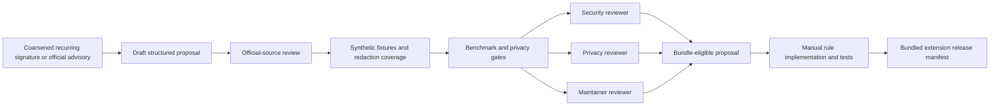

# HallGuard Rule Knowledge Workflow

This document defines how privacy-safe structural observations and public security documentation may become a proposed HallGuard detection rule. It is a review and release workflow, not an autonomous rule generator.

## Runtime boundary

The synchronous browser path remains unchanged:

1. Bundled deterministic rules and the shadow classifier run locally.
2. No network call is required for analysis or enforcement.
3. No research system may read prompts, candidates, files, screenshots, DOM content, activity logs, or redacted snippets.
4. Rules become available only through a reviewed Chrome extension release.

E7 adds no research endpoint, background worker, Redis/BullMQ queue, LLM, LangGraph, vector database, remote JavaScript, remote regex, or remote rule activation.

## Privacy-safe structural intake

The server may aggregate only events already collected through the separate, off-by-default `Improve HallGuard detection` consent from E5. The `ruleKnowledge` service coarsens those numerical events again and groups them without returning:

- user ids;
- event ids;
- timestamps;
- raw or redacted snippets;
- candidate values or exact candidate hashes;
- literal candidate prefixes;
- surrounding text, hostnames, files, or screenshots;
- action histories or per-user behavior histories;
- exact event or contributor counts.

A recurring signature is emitted only when the same structural bucket has at least 20 events from at least 5 distinct contributors. Output support and contributor counts are bands. The floor is enforced inside the service and cannot be lowered by a caller.

The output contains only model/rule-set versions, confidence band, length/entropy/composition buckets, approved binary context indicators, support bands, contributor bands, and an aggregate feedback signal. It is not persisted or exposed by an API in E7.

## Research sources

Rule proposals accept only HTTPS references classified as:

- `official-docs`; or
- `security-advisory`.

Customer content, telemetry examples, forum posts, arbitrary web pages, copied credentials, and generated regex are not valid research sources. A documented public prefix may be recorded as a bounded structured fact from an official source; it must never be inferred from customer telemetry.

## Proposal contract

A proposal is an exact-field, versioned structured record containing:

- proposal/rule identifiers and version;
- vendor and credential type labels;
- one allowed strategy and severity;
- a stable evidence code;
- official source references;
- bounded length, character-class, documented-prefix, and context-keyword facts;
- a synthetic fixture-generator id;
- sanitized benchmark counts and metrics;
- lifecycle status and approval records.

Proposals do not accept JavaScript, regex, code, prompt examples, secret examples, arbitrary content fields, executable URLs, or unknown properties.

## Review and release states

Eligibility requires:

- proposal status `approved`;
- no rejected review;
- three distinct reviewers covering security, privacy, and maintainer roles;
- at least 20 risky synthetic fixtures and 100 benign fixtures;
- 100% critical recall for the supported proposed format;
- at most 2% benign false-positive rate;
- 100% redaction coverage and raw-leak safety;
- P95 below 10 ms at 10 KiB and below 25 ms at 100 KiB.

Eligibility does not automatically create or activate a rule. A maintainer must implement the rule and redaction behavior, add fixtures, update `rules.json`, increment versions, and create a release-manifest entry tied to the approved proposal.

## Bundled release manifest

The extension validates `rule-release-manifest.json` at startup/build time. It requires exact coverage of every bundled rule id, version, and status and fixes distribution to `bundled-extension`.

The existing rules predate E7 and are recorded honestly as `baseline` entries with no approval claims. Any future `approved-proposal` entry must reference matching approval ids from three distinct reviewers across the required roles.

The v1 manifest hard-codes:

- `remoteUpdatesEnabled: false`;
- `executablePayloadAllowed: false`;
- `remoteRegexAllowed: false`;
- `futureSignedUpdates: not-enabled-v1`.

## Future signed-update design

Signed remote data updates are not implemented. The V2-0 contract and threat model
are defined in `docs/SIGNED_INTELLIGENCE_PACKAGE_SPEC.md`, with exact manifest
and trust-bundle schemas under `docs/contracts/`. The contract defines canonical
serialization, Ed25519 signatures, SHA-256 payload binding, key
custody/rotation/revocation, freshness and rollback protection, compatibility
constraints, audit records, recovery behavior, and browser-offline fallback.

Even a future signed format must remain data-only, schema-validated, bounded, non-executable, and incapable of carrying JavaScript or arbitrary regex. Human approval and release gates remain mandatory.

## Model releases

E7 does not create or approve a model. Classifier datasets, training, calibration, poisoning review, and artifact handoff remain governed by ML M0–M4. A future offline-trained artifact requires the same independent security, privacy, and maintainer review before its status or enforcement behavior can change.

## Implementation locations

- Extension manifest/contracts: `extension/src/features/detection/ruleRelease.ts` and `rule-release-manifest.json`.
- Server structural aggregation/proposals: `server/src/modules/ruleKnowledge/`.
- Offline classifier workflow: `ml/HANDOFF.md`.
- Privacy architecture: `docs/TRUST_ARCHITECTURE.md`.
