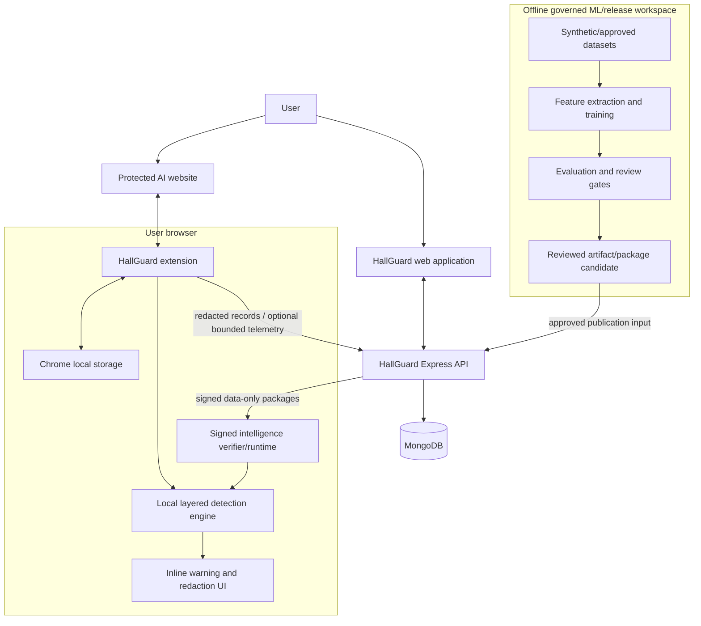
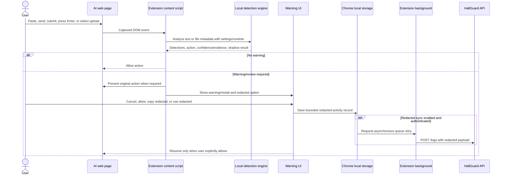
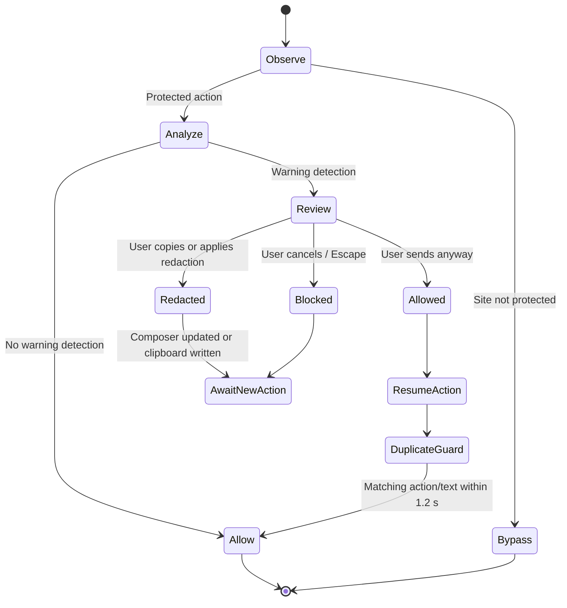
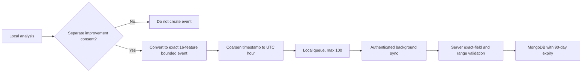
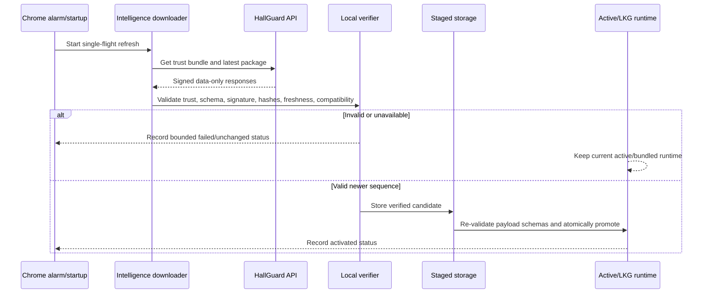

# HallGuard Technical Architecture

## 1. Purpose and scope

This document describes the current HallGuard implementation across the browser extension, web client, backend API, MongoDB data layer, offline ML workspace, and signed intelligence-package pipeline. It includes system functionality, technical workflows, a high-level design (HLD), and a low-level design (LLD).

The description is based on the repository as of 2026-08-11. Where a capability is incomplete or intentionally limited, that boundary is called out explicitly.

## 2. System overview

HallGuard is a local-first AI permission firewall. It intercepts relevant actions on protected HTTPS pages, analyzes text or upload metadata inside the browser, and shows an inline warning before a risky action continues. The server is not an inference service. It handles identity, redacted reporting, organizations, protected-site metadata, bounded improvement telemetry, administrative benchmark access, and signed intelligence distribution.

The system consists of four deployable/workspace areas:

| Area | Technology | Responsibility |
| --- | --- | --- |
| `extension/` | Plasmo, React, TypeScript, Chrome Extension APIs | DOM interception, local detection, warning UI, redaction, local storage, sync queues, signed intelligence verification/activation |
| `client/` | React, Vite, TypeScript, Tailwind CSS, Framer Motion | Marketing site, authentication UI, personal reports, team administration, trust/benchmark UI, extension bridge |
| `server/` | Node.js, Express 5, TypeScript, MongoDB, JWT, bcrypt | API, authentication, redacted log persistence, organizations, sites, telemetry, retention, intelligence publication/retrieval |
| `ml/` | Python 3.14, NumPy, pandas, scikit-learn, pytest | Isolated synthetic-data generation, governance, feature extraction, training, evaluation, review evidence, artifact/package compatibility |

## 3. Architectural principles

1. **Raw-content analysis remains local.** The server has no prompt-inference endpoint.
2. **The browser client is not blindly trusted.** Synced redacted records and telemetry are independently schema-validated by the server.
3. **Detectors inform policy; they do not directly own product behavior.** The layered engine returns results and an action, and the browser workflow decides how to interrupt and resume user actions.
4. **The classifier is governed separately.** It performs deterministic local inference but remains subject to artifact status and activation gates. Current public copy describes it as shadow-only for warning decisions.
5. **Network failure must not disable local protection.** Queues retry asynchronously, and intelligence refresh retains bundled or last-known-good runtime data.
6. **Remote intelligence is data-only.** Packages cannot introduce JavaScript, WebAssembly, HTML, executable code, or arbitrary remote regular expressions.
7. **Privacy controls are independent.** Redacted report sync and improvement telemetry are separate settings; improvement telemetry is off by default.
8. **Bound all sensitive processing.** Inspection is limited to 256 KiB, redacted synced snippets to 240 characters, and local queues/history have fixed caps.
9. **Fail closed at trust boundaries.** Invalid schemas, unsupported capabilities, stale/replayed packages, invalid signatures, and mismatched payloads are rejected.

## 4. High-level design (HLD)

### 4.1 Context architecture



### 4.2 Trust boundaries

| Boundary | Trusted for | Not trusted for |
| --- | --- | --- |
| Extension runtime | Local interception and immediate user experience | Authoritative server identity or bypass-proof enterprise enforcement |
| Web client | User interaction and extension bridge initiation | Access-control decisions or payload integrity |
| API | Authentication, authorization, schema enforcement, persistence | Receiving raw prompt text for classification |
| MongoDB | Durable application data after validation | Arbitrary unvalidated extension payloads |
| Intelligence publisher | Submitting reviewed release material | Bypassing governance because a package is signed |
| ML workspace | Offline governed model work | Importing application/customer/telemetry content or activating releases automatically |

### 4.3 Primary runtime flow



## 5. Functional architecture

### 5.1 Browser extension

#### Content interception

The Plasmo content script runs at `document_idle` in the top frame of HTTPS pages. Protection is active only when the current hostname matches a configured protected site. Host matching accepts the exact domain or its subdomains.

It watches:

- `paste` events;
- form `submit` events;
- Enter key presses in recognized composer elements;
- clicks on recognized send buttons;
- file-input `change` events;
- DOM mutations containing assistant output;
- focus/input/selection/scroll/resize events for the composer badge.

Recognized composer selectors include textareas, text inputs, contenteditable elements, role-based textboxes, and ProseMirror editors. Send selectors cover common test-id, aria-label, title, and submit-button forms.

#### Local detection layers

The extension exports a layered `analyze(input, context)` boundary. The engine combines:

- Unicode/NFKC and zero-width normalization;
- deterministic sensitive-data rules;
- prompt-injection rules;
- scam/fraud rules;
- risky-upload metadata rules;
- bounded candidate extraction;
- a 16-feature logistic classifier artifact and deterministic TypeScript scoring;
- confidence, evidence-code, rule-id, rule-set-version, and model-version metadata;
- a policy layer that maps signals and user sensitivity to an action;
- local shadow comparison between deterministic and classifier-hypothetical action.

Known benign shapes such as UUIDs, common standalone hashes, ISO timestamps, semantic versions, explicit placeholders, and ordinary identifiers are excluded on an inspection copy to reduce false positives. The user's original content is not mutated during analysis.

The maximum inspected input is 256 KiB. Oversized content produces an incomplete-scan high-risk warning rather than silently treating the content as safe.

#### Decision and warning UX

The content script enriches engine detections with confidence bands and evidence. It selects the highest-severity result for the main warning.

- High-risk paste is prevented until review.
- Send/submit/click/Enter actions with warnings are prevented and can be resumed after explicit user approval.
- Medium/lower paste findings can generate a warning toast while the paste proceeds.
- Upload review uses file name, media type, and size; file bodies are not read.
- Assistant-output scanning only surfaces prompt-injection and scam/fraud categories.
- A short-lived hash/action cache avoids duplicate interception when a resumed action emits a second DOM event within 1.2 seconds.

Available user outcomes are `warned`, `blocked`, `ignored`, `allowed`, and `redacted-copied`. Feedback can be `correct-warning`, `false-alarm`, or `missed-risk` where the relevant UI supports it.

#### Redaction

Sensitive-value redaction occurs before local activity records and sync queue entries are created. Recognized patterns are replaced with placeholders. A second local-only structural candidate layer can replace supported unknown-format candidates with `[REDACTED_CANDIDATE]` without enabling classifier-driven warnings.

The extension can:

- show a redacted preview;
- copy redacted text to the clipboard;
- replace composer content with redacted text;
- store only a 240-character redacted snippet in an activity record.

#### Local state

Chrome local storage contains:

| Data | Key/purpose | Bound |
| --- | --- | --- |
| Protection settings | Category toggles, sensitivity, redacted sync, improvement consent | One settings object |
| Protected sites | Personal/default/organization-managed site metadata | Normalized list |
| Activity logs | Recent redacted warning records | 50 |
| Feedback records | Metadata-only feedback | 100 |
| Redacted sync queue | Records awaiting authenticated API sync | 100 |
| Improvement queue | Bounded content-free derived events | 100 |
| Authentication | Account bearer token/status | Current session token |
| Intelligence state | Staged, active, last-known-good package and refresh status | Versioned package state |

The code has an in-memory fallback for storage unit tests/non-Chrome execution.

#### Background service

On startup, the background module:

- retries queued redacted logs;
- retries queued improvement events;
- initializes intelligence refresh alarms;
- attempts a configured intelligence refresh.

It accepts internal messages to retry queues or update protected sites. It accepts external messages from allowed HallGuard web origins to save an auth token or protected-site list. Updating sites reloads matching open tabs so the content-script activation boundary is refreshed.

### 5.2 Web client

The client is a Vite/React single-page application with path-based rendering. It provides:

- marketing/home page;
- signup and login pages;
- personal reports page;
- team/organization management page;
- privacy policy page;
- trust/benchmark page;
- shared header/session/logout behavior.

The client uses schema-validation modules around API responses and feature-specific API clients. It bridges authentication and protected-site state to the extension through Chrome's externally connectable messaging contract when the extension is installed.

The website correctly presents the current product as local-first, with redacted report sync, a shadow-only optional classifier, and initial support for ChatGPT, Claude, and Gemini.

### 5.3 Backend API

The Express application applies operational middleware in this order:

1. request ID;
2. structured request logging;
3. global rate limiting;
4. credentialed CORS allowlist for the website and extension origin;
5. JSON parsing capped at 128 KiB;
6. cookie parsing;
7. normalized error responses;
8. rejection of request bodies on read methods;
9. feature routers;
10. final error boundary.

Startup connects to MongoDB and ensures indexes before reporting readiness. `/health` reports process health; `/ready` also verifies application readiness and database connectivity. A 15-minute retention timer deletes expired improvement and intelligence-governance records. SIGTERM/SIGINT shut down readiness, HTTP, and MongoDB cleanly.

#### Authentication

- Email/password registration and login.
- Passwords hashed with bcrypt cost 12.
- JWTs expire after seven days.
- Website sessions use an HTTP-only, SameSite=Lax cookie, Secure in production.
- Extension requests may use `Authorization: Bearer <token>`.
- Pending organization invitations matching the authenticated email are activated during signup/login.

#### API surface

| Method and path | Access | Function |
| --- | --- | --- |
| `GET /health` | Public | Process health |
| `GET /ready` | Public | App/database readiness |
| `POST /auth/signup` | Public, auth rate limit | Create account and session |
| `POST /auth/login` | Public, auth rate limit | Authenticate and create session |
| `POST /auth/logout` | Session-aware | Clear session |
| `GET /auth/session` | Session-aware | Return current public user or null state |
| `GET /logs` | Authenticated | Filtered personal redacted logs |
| `POST /logs` | Authenticated | Validate and idempotently save redacted extension log |
| `GET /logs/summary` | Authenticated | Personal aggregate counts/rates |
| `GET /logs/export` | Authenticated | Export all account-backed redacted logs |
| `GET /sites` | Authenticated | Merge personal/default and inherited organization sites |
| `POST /sites` | Authenticated | Upsert a personal protected site |
| `DELETE /sites/:id` | Authenticated | Soft-delete an owned site unless organization-managed |
| `GET /orgs` | Authenticated | List active organization memberships |
| `POST /orgs` | Authenticated | Create organization and owner membership |
| `GET /orgs/:id` | Member | Organization, member list, aggregate summary |
| `GET /orgs/:id/trends` | Member | Daily aggregate trend window |
| `GET /orgs/:id/sites` | Member | Organization protected-site policies |
| `POST /orgs/:id/sites` | Owner/admin | Upsert organization protected site |
| `DELETE /orgs/:id/sites/:siteId` | Owner/admin | Remove organization site policy |
| `POST /orgs/:id/members` | Owner/admin | Invite/activate member and assign role |
| `PATCH /orgs/:id/members/:memberId` | Owner/admin | Change non-owner role subject to admin constraints |
| `POST /orgs/:id/invitations/:memberId/revoke` | Owner/admin | Revoke a pending invitation |
| `DELETE /orgs/:id/members/:memberId` | Owner/admin | Remove an active non-owner member |
| `POST /improvement-events` | Authenticated | Store allowlisted opt-in feature event |
| `GET /improvement-events/export` | Authenticated | Export the user's content-free events |
| `DELETE /improvement-events` | Authenticated | Delete the user's improvement events |
| `GET /admin/benchmark` | Active organization owner/admin | Sanitized synthetic benchmark snapshot |
| `GET /intelligence/packages/latest` | Authenticated | Retrieve latest eligible signed package |
| `GET /intelligence/trust-bundles/latest` | Authenticated | Retrieve latest trust bundle |
| `POST /intelligence/publish` | Owner/admin plus publisher allowlist | Governed atomic package publication |
| `GET /intelligence/audits` | Authorized publisher role | Release audit metadata |
| `POST /intelligence/revocations` | Authorized publisher role | Record reviewed package revocation |
| `GET /intelligence/revocations` | Authorized publisher role | List revocation records |

Query fields, request bodies, enums, lengths, and response keys are allowlisted by feature schemas. Unknown or malformed values fail validation.

### 5.4 MongoDB data architecture

Core collections include:

| Collection | Key fields | Important indexes/behavior |
| --- | --- | --- |
| `users` | email, passwordHash, timestamps | Unique email |
| `synced_logs` | userId, extensionLogId, timestamp, tool, hostname, category, severity, decision, feedback, redactedSnippet, evidence | Unique `(userId, extensionLogId)`; user/time and user/tool/time indexes |
| `report_sites` | userId, hostname, label, default/deleted timestamps | Unique `(userId, hostname)`; soft deletion |
| `organizations` | name, ownerUserId, timestamps | Owner/time index |
| `organization_members` | organizationId, optional userId, email, role, status | Unique `(organizationId, email)`; invitation lifecycle |
| `organization_site_policies` | organizationId, hostname, label | Unique `(organizationId, hostname)` |
| `improvement_events` | userId, event id, bounded features/categories/versions/outcome, expiry | Idempotent user/event storage; 90-day expiry metadata |
| Intelligence publication/trust/audit/revocation collections | signed package/trust bytes and content-free governance metadata | Sequence/version uniqueness, transactional publication, retention metadata |

Personal report queries are always scoped by authenticated `userId`. Organization summaries collect active member IDs and aggregate their metadata; the response does not return member prompt snippets.

### 5.5 Offline ML workspace

The Python workspace is deliberately isolated from application runtimes and customer data. Governance rejects undeclared files, forbidden application imports, and contract drift.

The pipeline includes:

1. deterministic synthetic generator families;
2. exact-field dataset manifests and provenance;
3. text-to-16-feature extraction, after which text/offsets are discarded;
4. label-stratified grouped 60/20/20 splitting that keeps mutation families together;
5. train-only standardization;
6. pinned scikit-learn logistic regression (`lbfgs`, L2, deterministic seed);
7. content-free aggregate evaluation;
8. multi-role privacy/security/maintainer review artifacts;
9. runtime artifact and intelligence-package compatibility validation.

The workspace forbids customer prompts, redacted snippets, production logs, telemetry payloads, real secrets, personal data, screenshots, and file bodies. A model output cannot activate itself; release and extension gates remain separate.

### 5.6 Signed intelligence subsystem

Logical package contents are:

```text
manifest.json
manifest.sig
payload/rules.json   # optional declarative data
payload/model.json   # optional validated artifact
```

The trust chain uses Ed25519 signatures and SHA-256 payload binding. Before activation, the extension checks:

- exact manifest and signature-envelope schemas;
- trusted, non-revoked signing key;
- canonical signed payload;
- every entry path, media type, byte size, and digest;
- no missing, duplicate, extra, traversal, or code-bearing entries;
- package issue/expiry dates and future-time skew;
- monotonically increasing sequence;
- extension version and required capabilities;
- rules/model runtime schema and version compatibility;
- explicit higher-sequence rollback metadata when applicable.

Activation is staged then atomic. The previous active package becomes last-known-good. If active storage is invalid, the runtime attempts recovery from last-known-good; otherwise it uses bundled rules/model data. Refresh runs on a six-hour alarm with a one-minute initial delay, single-flight protection, and bounded retry status. A network or verification failure never replaces the active package.

Remote rules can identify reviewed metadata associated with existing deterministic detection, but cannot inject executable detector code or arbitrary regex. A package model may replace compatible local artifact data, but it cannot change telemetry consent, redaction rules, organization policy, or enforcement thresholds.

## 6. Low-level design (LLD)

### 6.1 Extension module map

```text
extension/src/
├── contents/ai-firewall.ts
│   └── DOM adapters, event interception, warning/resume orchestration
├── background.ts
│   └── queue retries, external bridge, site refresh, intelligence scheduler
├── popup.tsx
│   └── settings, auth, activity, feedback/export controls
├── features/
│   ├── detection/
│   │   ├── engine/policy/rules/contracts
│   │   ├── candidate extraction and benign-shape filtering
│   │   ├── classifier artifact loading/scoring/gates
│   │   └── rule release manifest and benchmarks
│   ├── warnings/
│   │   └── analysis enrichment, evidence and preview helpers
│   ├── storage/
│   │   └── Chrome persistence, redacted-log queue and sync
│   ├── auth/
│   │   └── token/status storage and API configuration
│   ├── protectedSites/
│   │   └── protected-site feature boundary
│   ├── improvementTelemetry/
│   │   └── exact-field feature events, consent, queue and sync
│   └── intelligence/
│       └── retrieval, verification, staging, activation, runtime and refresh
└── firewall/
    ├── core.ts
    └── compatibility re-exports/types
```

### 6.2 Detection call contract

Conceptually, the warning path is:

```text
AnalyzeInput { text?, files? }
  + ProtectionSettings
  + IntelligenceRuntime { classifierArtifact?, ruleSet?, source }
        |
        v
normalize -> deterministic rules -> candidates/features -> classifier shadow
        -> policy/action -> results/detections -> WarningAnalysis
```

`WarningAnalysis` contains the base analysis plus `warningDetections`. Each surfaced detection can include:

- category and severity;
- user-facing title/message;
- bounded evidence labels and codes;
- confidence and confidence band;
- detector source;
- rule IDs;
- model and rule-set versions;
- incomplete-scan marker.

The classifier contract deliberately excludes candidate values, literal prefixes, exact hashes, and surrounding text from its output.

### 6.3 Send-action state machine



The duplicate guard stores only an in-memory action label, non-cryptographic text hash, allowed flag, and timestamp. It prevents the extension from reopening its modal when it programmatically resumes a click or submit.

### 6.4 Redacted log synchronization

1. A warning outcome calls `queueDetectionLog`.
2. `logDetection` constructs an `ActivityLog` using a random local ID, timestamp, normalized site, category, severity, decision, optional feedback, title, bounded evidence, and `redactSnippet(...)` output.
3. `addActivityLog` prepends the record and truncates local history to 50.
4. If redacted sync is enabled, it deduplicates into the 100-entry queue.
5. The background worker reads the auth state and bearer token.
6. It converts `site` into a canonical hostname and AI-tool enum.
7. `POST /logs` validates the exact payload, including the redaction policy.
8. MongoDB upserts/saves under authenticated `userId`, protected by unique `(userId, extensionLogId)`.
9. Successful records leave the queue; failures remain for retry.

Authentication failure does not delete the queued record. Disabling redacted sync stops retry/queueing for new operations according to the current settings path.

### 6.5 Improvement telemetry synchronization

This path is independent of redacted reports:



The server schema has no fields for prompts, snippets, candidates, hashes, literal prefixes, hostnames, files, screenshots, or arbitrary context. Users can export or delete their server-held improvement events. Retention sweeps remove expired records.

### 6.6 Protected-site merge and propagation

`GET /sites` ensures the default personal sites exist, loads active organization memberships/policies, and merges by hostname:

- personal entries are `source: personal`, `managed: false`;
- organization policies override the same hostname as managed and attach organization metadata;
- default entries sort first, followed by label;
- a personal site cannot be deleted while an inherited organization policy protects the hostname.

The website sends the resulting list through the external extension bridge. The background validates the structural shape, normalizes fields, stores the list, and reloads currently open matching tabs.

### 6.7 Organization authorization rules

Roles are `owner`, `admin`, and `member`.

- Any active member may view their organization, member list, protected sites, summary, and trends.
- Owner/admin may manage protected sites, invite members, change roles, revoke invitations, and remove members.
- The owner role cannot be changed or removed through the current member endpoints.
- An admin cannot change/remove another admin or revoke an admin invitation.
- Invitations are stored by normalized email and become active when that email signs up or logs in.
- Revoked invitations unset `userId` and cannot be activated until explicitly re-invited/upserted.

### 6.8 Organization reporting algorithm

For an organization summary:

1. Load all membership records for invitation counts.
2. Select active memberships with a `userId`.
3. Query only metadata fields from logs belonging to those user IDs.
4. Count severity, event type, decision, hostname, and feedback.
5. Compute false-alarm and missed-risk rates using feedback count as denominator.
6. Return aggregate data plus active/invited/revoked counts.

Trend queries create a bounded day window, initialize daily points, load only matching metadata within `[from, to)`, and add each log to its day bucket.

### 6.9 Intelligence publication transaction

The publisher endpoint requires all of:

- authenticated user;
- active organization owner/admin membership;
- email in `INTELLIGENCE_PUBLISHER_EMAILS`;
- signer mode and release configuration satisfying policy;
- exact package/trust/signature/governance schemas;
- matching release ID, package sequence/version, trust-bundle version, signing key ID, payload digests, benchmark/redaction gates, and distinct security/privacy/maintainer approvals.

The repository inserts immutable publication data and its content-free audit record in one MongoDB transaction. Revocation records are metadata-only; the server does not mutate previously signed bytes or a client's local active pointer.

### 6.10 Intelligence refresh and recovery



Refresh status is one of `disabled`, `refreshing`, `unchanged`, `activated`, or `failed`. Error text is not persisted. Consecutive failures are capped at three for the short retry loop; the regular six-hour schedule remains.

## 7. Security and privacy design

### 7.1 Data minimization

| Data type | Local processing | Local storage | Server storage |
| --- | --- | --- | --- |
| Full composer/paste text | Yes, transient | No full prompt by design | Never accepted for inference |
| File content | No | No | No |
| File metadata | Yes, transient for detection | May influence redacted event metadata/evidence | No file body |
| Redacted snippet | Generated locally | Up to 240 chars per record | Accepted after independent validation |
| Detection metadata | Yes | Bounded history/queues | Personal logs and aggregate reporting |
| Classifier features | Yes | Only opt-in bounded event queue | Only separate opt-in, 90-day expiry |
| Intelligence package | Verified locally | Active/LKG/staged package state | Published signed bytes and audit metadata |

### 7.2 Application controls

- CORS allowlist with credentials.
- 128 KiB API JSON body limit.
- Global and auth-specific rate limiting.
- Structured logs designed to avoid raw sensitive values.
- Exact-field request and response validation.
- JWT verification and ObjectId validation.
- Role-based organization checks.
- Publisher email allowlist in addition to organization role.
- MongoDB uniqueness constraints for idempotency and integrity.
- Independent redaction-policy rejection at the server.
- Bounded retention for improvement and governance metadata.

### 7.3 Intelligence threat controls

| Threat | Control |
| --- | --- |
| Modified bytes | Detached signature and SHA-256 entry verification |
| Unknown key | Reviewed root/trust bundle and bounded key IDs |
| Replay/downgrade | Monotonic sequence, issue/expiry checks, explicit higher-sequence rollback |
| Archive traversal/extra payload | Exact relative path allowlist |
| Executable update | Data-only schemas and media-type/capability restrictions |
| Interrupted activation | Staging plus atomic promotion |
| Corrupt local state | Last-known-good recovery then bundled fallback |
| Server outage | Continue local detection with current/bundled runtime |
| Malicious but validly signed release | Independent review and benchmark/privacy gates |

### 7.4 Important limitations

- A browser extension can be inspected or disabled by a sufficiently privileged local user; it is not a tamper-proof endpoint boundary.
- Current enterprise policy is mostly protected-site metadata, not a full centrally enforced DLP policy language.
- DOM selector changes on AI sites can break interception until adapted.
- Deterministic rules can miss new formats and can produce false positives.
- The local classifier's synthetic results are not a production accuracy claim.
- Upload detection does not inspect file contents.
- Redaction cannot guarantee coverage of every unforeseen sensitive format.
- Permanent account-wide deletion is not yet exposed as a complete self-service lifecycle.
- Production signing keys/publisher identities must be securely provisioned; private keys must not be stored in application code or normal application storage.

## 8. Deployment architecture

### Web client

- Built with `tsc -b && vite build`.
- `vercel.json` is present for static/web deployment routing.
- Requires the API base URL and extension-connect configuration appropriate to the environment.

### API

- Built with TypeScript and started from `dist/index.js`.
- Required environment variables: `MONGODB_URI` and `JWT_SECRET`.
- Important optional/configured variables include database name, port, client origin, extension origin, intelligence publisher emails, audit retention, and signer mode.
- Production must use a strong JWT secret, HTTPS, restricted origins, managed MongoDB access, backups, monitoring, and a reviewed publisher configuration.

### Extension

- Built/packaged by Plasmo.
- Requires reviewed host permissions and externally connectable website origins.
- Root public keys are supplied through bounded public configuration; malformed/missing configuration disables refresh rather than trusting an unknown key.
- Chrome Web Store packaging/versioning is separate from data-only intelligence package versioning.

### ML/release workspace

- Runs offline with exact CPython/dependency pins.
- Generated raw synthetic rows and draft artifacts are ignored unless a reviewed step explicitly allows an output.
- Release artifacts move into the publisher process only after governance and compatibility checks.

## 9. Reliability and operational behavior

- `/health` distinguishes process availability from `/ready` database/application readiness.
- Index creation completes before the server marks itself ready.
- Graceful shutdown stops readiness before closing HTTP and MongoDB.
- Redacted logs and improvement events use local retry queues.
- Intelligence refresh is single-flight and scheduled; failures retain existing protection.
- Transactional intelligence publication avoids package/audit partial state.
- Local active package promotion is atomic with last-known-good recovery.
- Server request IDs and structured logging support incident correlation without logging raw prompt payloads.

Recommended production additions include centralized metrics, alerting on readiness/refresh/publisher failures, backup-restore drills, key-rotation drills, browser compatibility monitoring, and explicit service-level objectives.

## 10. Testing and verification

### Extension

- Vitest unit/regression tests for detectors, benign shapes, classifier, candidate redaction, policy gates, intelligence verification/activation/runtime/refresh, warning analysis, telemetry, and benchmarks.
- `npm run typecheck`
- `npm test`
- `npm run build`
- Dedicated benchmark and intelligence-drill scripts.

### Server

- Node test runner with `tsx` for schemas, operational middleware, errors, retention, models, trends, telemetry, rule knowledge, and intelligence governance/repository behavior.
- `npm run typecheck`
- `npm test`
- `npm run build`
- Dedicated intelligence drill.

### Client

- TypeScript build plus contract/release tests bundled with esbuild and executed by Node.
- `npm run typecheck`
- `npm test`
- `npm run build`

### ML

- Strict pytest suite covering generators, governance, features, splits, training, evaluation, intake, remediation/reviews, contracts, and intelligence-package compatibility.
- Ruff and strict mypy configuration.
- Workspace governance validation must precede data/training/export steps.

Synthetic benchmark results are regression evidence, not universal production performance claims. Real-world field validation must preserve the data-governance boundary.

## 11. Evolution path

### Near term

- Complete staging provisioning and run the signed-intelligence deployment drill.
- Improve site-specific DOM adapters and field-test interception.
- Validate warning fatigue, redaction usability, and operational telemetry.
- Keep public trust copy synchronized with actual storage and transmission behavior.

### Medium term

- Introduce versioned centrally managed organization policy without allowing intelligence packages to override policy.
- Add rollout rings, package health metrics, and safer managed rollback operations.
- Expand supported AI/custom surfaces using explicit adapters.
- Activate improved classifier behavior only after representative data, calibration, latency, redaction, privacy, security, and maintainer gates pass.

### Enterprise path

- SSO/SCIM and managed deployment.
- Tamper/health reporting appropriate to browser capabilities.
- Audit APIs and SIEM integrations.
- Configurable retention and regional/self-hosted deployment.
- Formal incident response, key management, penetration testing, compliance controls, and SLAs.

## 12. Source-of-truth references

The following repository documents remain authoritative for specialized contracts:

- `docs/TRUST_ARCHITECTURE.md` — privacy and trust boundaries.
- `docs/REDACTION_STORAGE_SPEC.md` — exact redaction/storage contract.
- `docs/SIGNED_INTELLIGENCE_PACKAGE_SPEC.md` — signed package and trust-chain specification.
- `docs/RULE_KNOWLEDGE_WORKFLOW.md` — reviewed rule research and release process.
- `docs/OPEN_SOURCE_CORE_BOUNDARY.md` — candidate public-core boundary.
- `docs/EXECUTION_PROTOCOL.md` — implementation/review discipline.
- `client/WEBSITE_HANDOFF.md`, `server/HANDOFF.md`, `extension/HANDOFF.md`, and `ml/HANDOFF.md` — component status and next authorized work.

## 13. Technical conclusion

HallGuard's architecture deliberately keeps the latency- and privacy-critical decision path in the browser. The hosted platform coordinates users, organizations, redacted evidence, bounded consented improvement data, and authenticated detection-intelligence delivery without becoming a raw-content prediction service.

The design is appropriate for an MVP evolving toward a security product because it combines local availability with server-side governance. Its next technical challenge is not adding a larger remote model; it is proving interception reliability, warning quality, redaction safety, release-key operations, and centrally managed policy while preserving the existing privacy boundary.
